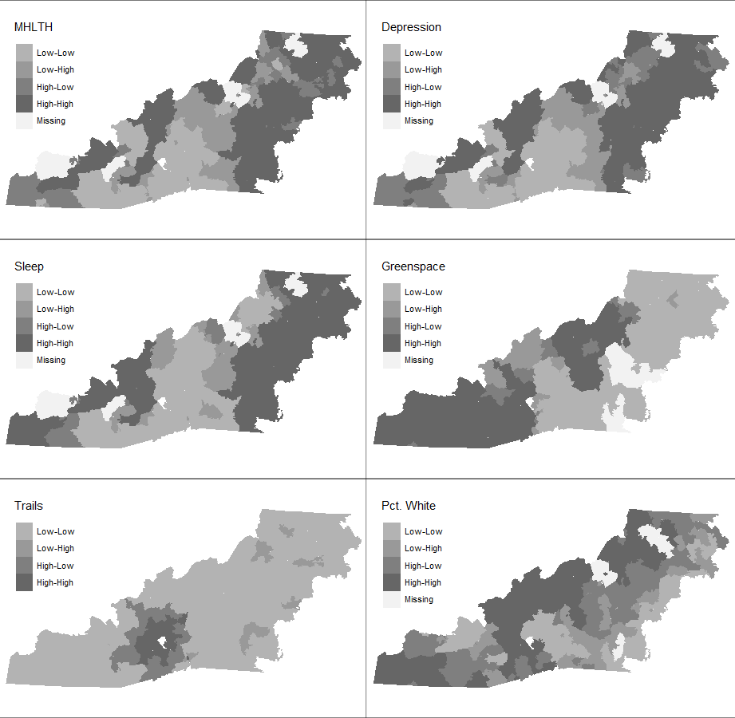

<!-----

WARNING:
You have some equations: look for ">>>>>  gd2md-html alert:  equation..." in output.

* Tables are currently converted to HTML tables.
* This document has images: check for >>>>>  gd2md-html alert:  inline image link in generated source and store images to your server. NOTE: Images in exported zip file from Google Docs may not appear in  the same order as they do in your doc. Please check the images!


WARNING:
You have 6 H1 headings. You may want to use the "H1 -> H2" option to demote all headings by one level.

----->


<!-- Authors: Harrison Brown, Josh R Platt, Sophia C Ryan, Maggie M Sugg, Jennifer D Runkle -->

```{r setup, include = FALSE}
knitr::opts_chunk$set(
  echo = FALSE
)

l <- readRDS("data/lagrange.Rds")
library(officedown)
library(tidyverse)
library(texreg)
library(spatialreg)
source("R/extract.R")
model_list <- readr::read_rds("model_list.Rds")
```


# INTRODUCTION

Proximity to greenspace is a potential determinant on an individual’s mental health [@nutsford2013; @ekkel2017; @collins2020; @sarkar2018; @jiang2021]. As a low-cost mental health intervention, greenspace provides restorative experiences, encourages social cohesion, reduces pollution, and offers opportunities for physical activity [@lachowycz2013; @wang2021]. To date, most greenspace research has focused on the greenspace mental health relationship in urban areas, with less attention focused on rural communities [@collins2020]. Within studies that have considered the greenspace mental health relationship in rural areas, evidence is mixed, with some studies finding greenspace benefits mental health similarly in rural areas as compared to urban areas [@verheij2008; @alcock2015]. Other research suggests that the rural greenspace mental health relationship differs from the urban relationship [@jiang2021], with private greenspaces — including yards, agricultural fields, and general “countryside greenness” — playing an important role in the rural greenspace mental health relationship [@ekkel2017]. As such, further investigation into the rural greenspace mental health relationship is needed, specifically with regards to public greenspace quality, in addition to greenspace quantity — i.e., available area within a greenspace.

Most greenspace studies consider greenspace quantity as the primary metric, with less attention given to greenspace quality [@collins2020]. Past research has found that an increased quantity of greenspace tends to correspond with better mental health outcomes [@vandillen2012; @wood2017; @wang2021]. However, more research is needed to determine whether greenspace quality — attributes including nearby amenities, “greenness” metrics like NDVI, or the presence of public hiking or biking trails — are significant predictors of mental health outcomes. 

Of the studies that have considered quality, the most common technique is the use of surveys, allowing the researcher to assess self-reported high-quality greenspace and mental health outcomes [@wang2021]. Other studies have qualified greenspace through consideration of the physical characteristics of the greenspace itself, such as land cover, conservation easements, land designations, species diversity and health and presence of birds [@wheeler2015], as well as water features and heavy tree cover which provides numerous options for shade in hot months [@mears2019]. The findings from these studies suggest that the quality of greenspace may be a crucial factor in the greenspace mental health relationship. Thus, consideration of greenspace quality is critical in better understanding the greenspace mental health relationship. 

Western North Carolina is a predominantly rural, mountainous region. Mental health care access is limited [@mahec], as is the case in many rural regions in the United States, despite similar or higher mental health case counts occurring in rural versus urban areas [@mccall-hosenfeld2014]. As such, investigation into low-cost mental health care interventions is important. This study investigates the greenspace mental health relationship in Western North Carolina to understand better the greenspace mental health relationship in rural, mountainous regions. To address research gaps, this study will consider greenspace quality in a region comprising mostly rural communities. This research adds to the growing body of greenspace mental health literature and adds new knowledge by assessing how greenspace quality influences mental health in rural regions. 


# METHODS


## Study Area

Several geographical, environmental, and administrative definitions of Western North Carolina (WNC) are defined across the literature; in this study, Western North Carolina is defined as communities enclosed in the North Carolina Blue Ridge Mountains, encompassing 160 total ZIP codes within 23 counties (Figure \@ref(fig:extent)). ZIP codes are used as the defining administrative level due to the availability of publicly-accessible mental health and demographic data, e.g., the PLACES dataset, which had substantial missing data at the census tract scale for this region. WNC is predominantly rural and mountainous, with pockets of urbanization, most notably Asheville, NC. Greenspace varies from public parks to expansive National Forest land (Figure \@ref(fig:gs-extent)).


```{r extent, fig.width = 4.5, fig.height=1.72, fig.id = "extent", fig.cap = "Extent of ZIP codes (dark gray) within Western NC (light gray)"}

```


<!-- Figure 1: Extent of ZIP codes (dark gray) within Western NC (light gray) -->


```{r gs-extent, fig.width = 4.5, fig.height=2.26, fig.id = "gs-extent", fig.cap = "Extent of combined PAD-US and ParkServe greenspace areas (dark gray)"}

```


<!-- Figure 2: Extent of combined PAD-US and ParkServe greenspace areas (dark gray) -->


## Mental Health Data

For this analysis, three mental health outcomes were considered: (1) general mental health (Feng & Astell-Burt, 2017; Houlden et al., 2019; Wheeler et al., 2015; Zhang et al., 2017),  (2) depression (Beyer et al., 2014; McEachen et al., 2015), and (3) poor sleep (Shin et al., 2020; Johnson et al., 2018; Feng et al., 2020). General mental health is defined as poor mental health for more than 14 days over the last month, depression is based on reported depression diagnoses from a health professional, and poor sleep is defined as regularly getting less than seven hours of sleep during a 24-hour period (CDC, 2022). The CDC PLACES dataset (CDC, 2022) from 2020 was used for mental health indicators. The PLACES dataset offers model-based, population-level community estimates of health outcomes, both physical and mental (CDC, 2022). All data is for adults aged 18 years or older. 


## Greenspace Quantity

This study identifies greenspace as areas encompassed by the Trust for Public Land’s ParkServe (ParkServe) dataset and The Protected Area Database of the United States (PAD-US) dataset from 2020 (Runkle et al., 2022; Slawsky et al., 2022; TPL 2020; USGS 2020). ParkServe is a dataset comprising all public parks, including local and city parks and playgrounds (TPL 2020). PAD-US is a spatial dataset of all government-managed greenspaces, such as national forest land, national parks, and historical areas (USGS 2020). All parks and public greenspaces selected from these two datasets were combined to form one public greenspace dataset (Figure \@ref(fig:gs-extent)). For consistency with the PLACES mental health datasets at the ZIP Code level, greenspace area was calculated as the percentage of an area within each ZIP code covered by greenspace (defined by the ParkServe and PAD-US datasets); redundant or overlapping greenspaces (i.e., the same greenspace within both datasets) were removed by performing a spatial union of the two datasets, such that overlapping greenspaces do not overestimate greenspace area.


## Greenspace Quality

For this analysis, greenspace quality was determined by looking at vegetation health, trail density, and amenity access as three separate quality metrics. Normalized difference vegetation index (NDVI) data (“Landsat-8 Imagery” 2019), ParkServe (TPL, 2020), and OpenStreetMap amenities data (OpenStreetMap, 2022) were used as metrics of greenspace quality. NDVI assesses vegetation density and health, which has been associated with improved mental health outcomes (Wood et al., 2018; Mears et al., 2019). This study calculated NDVI from Landsat-8 imagery from the months of June to August 2019 and filtered images by those with less than ten percent cloud cover. A spatial buffer of 1 km around the greenspace extent was used in calculating the mean NDVI within each greenspace to remove the effects of small “holes” in the dataset and for small parks whose area was smaller than the resolution of Landsat-8 imagery (30 meters).

Greenspace amenities data from ParkServe, specifically trail accessibility, and OpenStreetMap (OSM) data, provided information on how many greenspace-related amenities (e.g., restrooms, parking) are present in each ZIP Code. OSM data was queried for the study area with the _osmdata_ package for R (Padgham 2017) and subsequently spatially filtered to within a 1-km buffer of greenspace extent. This allows for amenities that are “nearby” to greenspaces (e.g., restrooms, restaurants, parking) to factor into greenspace quality. Amenities were summarized as the count of amenities within the 1-km buffer of greenspace extent, and were counted for each ZIP code.

## Covariates

Additional demographic predictor variables include population, race, and household income. Previous research has illustrated that race (Browning & Rigolon, 2018) and income (Hoffiman et al., 2017; deVries et al., 2020) influence the greenspace mental health relationship, as predominantly white, upper-class neighborhoods tend to have the greatest access to greenspaces (Rigolon et al., 2018). Race was accounted for by including the percentage of White residents, and income was accounted for by including the percentage of households with annual income over \$125,000/year. Race and Income variables are from 2018 ACS 5-year estimates (U.S. Census Bureau, 2018).


## Regression Analysis

All variables were tested for spatial autocorrelation; Moran’s I was used to assess spatial autocorrelation at a significance level of $p < 0.05$. *P*-values at or below 0.05 and an Moran’s I-statistic of $I \neq 0$ indicate spatial autocorrelation and spatial dependence, pointing to the need to perform spatial regression (Anselin, 2009; Legendre, 1993). The spatial weights matrix $W_{ij}$ was defined using the queen’s case rule. All variables except population, income and greenspace amenities were found to be spatially autocorrelated (Table \@ref(tab:moran-table)). Variables were tested for multicollinearity, no variables were above the threshold of 5 (Table \@ref(tab:vif)) (Craney & Surles, 2002). 

```{r moran-table, tab.id = "moran-table", tab.cap = "Calculated statistics for Moran’s I across predictor and response variables"}
moran <- read_rds("data/moran.Rds") %>%
  mutate(across(.cols = -1, .fns = function(x){signif(x, 3) %>% as.character()})) %>% 
`colnames<-`(c("Variable", "Moran's I", "Expected", "Variance", "SD", "p value"))
  

moran
# knitr::kable(moran,
#              format = "latex",
#              col.names = c("Variable", "Moran's I", "Expected", "Variance", "SD", "p value"))

```


<!-- _Table 1: Calculated statistics for Moran’s I across predictor and response variables._ -->

```{r vif, tab.id = "vif", tab.cap = "Variance Inflation Factors for variables"}
basic_list <- read_rds("data/basic_list.Rds")
bl <-
  basic_list %>% map_dfr(regclass::VIF) %>% t() %>% `row.names<-`(c(
    "Mean NDVI",
    "Greenspace Area",
    "Percent White",
    "Income",
    "Amenities",
    "Trails"
  )) %>% 
  `colnames<-`(c("MHLTH", "DEPRESSION", "SLEEP")) %>% 
  as.data.frame() %>% 
  tibble::rownames_to_column("Variable") %>% 
  mutate(across(2:4, .fns = signif, digits = 4))
bl

```


<!-- _Table a: Variance Inflation Factors for variables. _ -->

The Lagrange multiplier diagnostics for spatial dependence test was conducted, which illustrates the spatial regression model (spatial error, spatial lag, and robust versions) that performs best for the spatially autocorrelated variables. The spatial regression with the lowest _p_-value and highest statistic was selected. For this analysis, the spatial lag model was the most significant model (Table \@ref(tab:lagrange)).

<!-- _Table 2: Results from Robust Lagrange Multiplier Test. Spatial lag regression was used in this analysis._ -->


```{r, lagrange, tab.id = "lagrange", tab.cap = "Results from Robust Lagrange Multiplier Test. Spatial lag regression was used in this analysis"}
# l$p.value <- as.character(signif(l$p.value))
l2 <- l[1:4, -3] %>%
  mutate(across(2:3, signif, digits = 4)) %>%
  mutate(Method = c("Spatial Error (SE)",
                    "Spatial Lag (SL)",
                    "Robust SE",
                    "Robust SL")) %>% 
  `colnames<-`(c("Method", "Lagrange Multiplier", "p-value"))

l2

```


All regression analysis considered greenspace metrics (quantity, NDVI, trail density, and amenities) in addition to percent of the ZIP Code that is White and percent of households in each ZIP Code that makes over \$125,000 per year. All regression analyses were performed in RStudio version 2022.2.3.492 with R version 4.2.0 (2022-04-22 ucrt) (RStudio Team, 2022; R Core Team, 2022). 


## Local Indicators of Spatial Autocorrelation (LISA)

Given that the data were spatially autocorrelated, Local Indicators of Spatial Autocorrelation (LISA) were used to identify and visualize spatially explicit clustering of health outcomes, greenspace metrics and demographic and socioeconomic variables (Figure \@ref(fig:lisa)). LISA clustering was not significant across variables. However, the results highlight trends of spatially explicit clustering. High-high clustering illustrates locations with high rates of the variable of interest that are surrounded by other locations with high rates of the variable, high-low corresponds to high rates surrounded by low rates, low-low illustrates low rates surrounded by low rates and low-high signals low rates surrounded by high rates.


```{r lisa, fig.width=4.5, fig.id = "lisa", fig.cap = "Results from LISA highlighting general trend from hot (high-high) to cold(low-low) clustering of each variable. Note that not all locations have a p-value < 0.05 and that this figure is meant as a visual aid"}

```


<!-- Figure 3: Results from LISA analysis highlighting hot (high-high) and cold (low-low) clustering of each variable -->


# RESULTS


## General Mental Health

Spatial regression analysis found that none of the greenspace metrics were associated with reductions in reported poor mental health (Table \@ref(tab:sarlm)). Percent of the ZIP Code that is White ($\beta = -4.476, p >0.001$) and percent of households in the ZIP Code making over \$125,000 ($\beta = -4.638, p > 0.001$) were significantly associated with reductions in mental health outcomes (Table \@ref(tab:sarlm)).


```{r tab.id = "sarlm", tab.cap = "Spatial lag regression coefficients for each mental health outcome"}
model_list %>%
  map(function(x) {
    extract.Sarlm2(x)
  }) %>%
  texreg::matrixreg(
    single.row = T,
    booktabs = T,
    dcolumn = T,
    custom.model.names = c("MHLTH", "DEPRESSION", "SLEEP"),
    custom.coef.names = c(
      NA,
      "Mean NDVI",
      "Greenspace Area",
      "Percent White",
      "Income",
      "Amenities",
      "Trails",
      "rho"
      
    ),
    float.pos = "h"
  ) %>% 
  as_tibble() %>% 
  `colnames<-`(.[1, ]) %>% 
  .[-1, ]
```


<!-- _Table 3: Spatial-Lag regression coefficients for mental health outcomes._ -->


## Depression

Greenspace metrics are not significantly associated with depression (Table \@ref(tab:sarlm)). Percent of the ZIP Code that is White was also not associated with changes in depression diagnoses. Percent of households making over \$125,000 per year was significantly associated with reductions in depression diagnoses ($\beta = -2.924, p = 0.004$) (Table \@ref(tab:sarlm)).


## Poor Sleep

Spatial regression found poor sleep to be significantly associated with greenspace metrics (Table \@ref(tab:sarlm)). Greenspace quantity ($\beta = 0.743, p = 0.026$) was significantly associated with an increase in reported poor sleep, while greenspace amenities ($\beta = -0.015, p < 0.001$) were significant;y associated with a decrease in reported poor sleep. Percent White ($\beta = -6.980, p < 0.001$) and percent of households making over \$125,000 ($\beta = -5.707, p > 0.001$) were both significantly associated with reductions in reported poor sleep outcomes (Table \@ref(tab:sarlm)). 

## Local Indicators of Spatial Autocorrelation (LISA)

LISA analysis identified spatially explicit locations of mental health, greenspace and sociodemographic clustering (Figure \@ref(fig:lisa)). All mental health outcomes illustrate similar clustering patterns, with high-high clustering found in the northern, eastern, and southwestern parts of the region. Low-low mental health clustering for all outcomes occurred in the central and southern part of the region. Greenspace clustering varied depending on the metric, with high-high trail length clustering in the southern part of the region, while greenspace quantity clustered in the southwest and northern parts of the region. NDVI clustered along the western edge of the region, and amenities, which clustered throughout the region. Race and income metrics (percent White and percent households with annual income over \$125,000) have high-high clustering dispersed throughout the region (Figure \@ref(fig:lisa)).


# DISCUSSION

The greenspace mental health relationship varied with health outcomes in Western North Carolina. Contrary to prior research in more urban areas (e.g., Houlden et al., 2019; Wang et al., 2021), this analysis did not find greenspace quantity to have a significant protective effect on any of the mental health outcomes. Greenspace quality was associated with reduced counts of poor reported sleep. While not statistically significant, LISA cluster analysis illustrated that mental health outcomes clustered together spatially, suggesting additional contextual predictors, such as race and income, may influence mental health outcomes in this region. 

Greenspace quality, specifically when measured as greenspace amenities, did have a small protective effect on poor sleep. Poor sleep is a precursor for additional poor mental health outcomes (Freeman et al., 2017; Baglioni et al., 2016). As such, mental health outcomes not included in this analysis may also be related to greenspace quality metrics in Western North Carolina. However, greenspace quantity was significantly associated with increased reports of poor sleep. Research on the greenspace-sleep relationship is still evolving, with most studies finding neighborhood greenspace benefits sleep (Shin et al., 2020; Johnson et al., 2018; Xie et al., 2020). However, other studies have found there is no positive relationship between greenspace and sleep (Feng et al., 2020; Chum et al., 2015). Additionally, the type of greenspace, specifically tree canopy compared to grassland, may influence the greenspace-sleep relationship (Astell-Burt and Feng, 2020), in conjunction with sociodemographic factors (Xie et al., 2020). Additional sociodemographic factors not considered in this analysis (e.g. employment, education) may influence the greenspace-sleep relationship. This analysis suggests the greenspace-sleep relationship is complex and may vary depending on the setting. 

Greenspace did not have significant protective effects for depression diagnoses or reported poor mental health. This finding contrasts a growing body of literature linking greenspace to better mental health outcomes (Beyer et al., 2014; Feng & Astell-Burt, 2017; Houlden et al., 2019; Wheeler et al., 2015; Zhang et al., 2017). As with poor sleep, there may be additional contextual factors, including rurality and sociodemographic characteristics, that are moderating this relationship. 

Across all health outcomes considered, demographic and socioeconomic factors were found to be better predictors of all mental health outcomes. For both poor mental health and sleep, race (percent White) was significantly associated with reductions in health outcomes. These results suggest that ZIP Codes with higher percentages of White individuals have fewer individuals reporting poor mental health and poor sleep. Income was significantly associated with reductions in poor mental health, poor sleep, and depression diagnoses. This result suggests that ZIP Codes with greater percentages of high-income households have fewer reported poor mental health outcomes, poor sleep, and depression diagnoses. These findings support literature that demographic and socioeconomic variables are driving influences of reported and diagnosed mental health outcomes (Gresenz et al., 2001; Reiss, 2013; Howell and McFeeters, 2008).


## Implications

This analysis illustrates the complexity of the greenspace-mental health relationship in rural, mountainous areas. Findings suggest that sociodemographic variables are more predictive of poor mental health outcomes than public greenspaces. LISA analysis highlights trends of spatially explicit locations with high mental health clustering that may need more targeted mental health interventions. These findings can be applied to public health policy and land management. 


## Strengths and Limitations

This article is strengthened by the greenspace metrics considered and the datasets utilized. This analysis considered multiple metrics of greenspace, allowing for deeper analysis into the greenspace mental health relationship. The inclusion of greenspace quality metrics strengthens this analysis as it illustrates the complexity of the greenspace mental health relationship. An additional strength of this analysis is that all data used is publically available, allowing for replicability.

	Several limitations to this study exist; this analysis was conducted regionally and therefore the results may not be directly applicable outside of the study area. Additional research is needed at larger scales and across wider geographic regions to better understand the greenspace mental health relationship in rural, mountainous regions. The use of publicly-sourced data (OpenStreetMap) may also lead to observation biases in urban areas — amenities in rural areas are less likely to be reported and present within OSM datasets. In general, this paper highlights the need for a consistent and unified system for categorizing and qualifying public greenspaces in terms of their quality. Additionally, datasets were collected at different time points, therefore temporal mismatch may occur. 


# CONCLUSIONS

This study considered the greenspace mental health relationship in Western North Carolina, a predominantly rural, mountainous region. Results suggest that the quantity of public greenspace is not significantly associated with reductions in poor mental health outcomes in this region. However, this analysis did find that greenspace quality, measured as greenspace amenities, benefits sleep. Across all mental health outcomes, sociodemographic factors (race and income) significantly predicted mental health. This analysis suggests that in Western North Carolina, demographic and socioeconomic factors are more predictive of poor mental health outcomes than the quantity or quality of public greenspaces.


# REFERENCES

<!-- Alcock, I. et al. 2015. What accounts for ‘England’s green and pleasant land’? A panel data analysis of mental health and land cover types in rural England. _Landscape and Urban Planning_ 142: 38–46.[ https://doi.org/10.1016/j.landurbplan.2015.05.008](https://doi.org/10.1016/j.landurbplan.2015.05.008). -->

<!-- Astell-Burt, T., and Feng, X. 2020. Does sleep grow on trees? A longitudinal study to investigate potential prevention of insufficient sleep with different types of urban green space. _SSM - Population Health_ 10: 100497.[ https://doi.org/10.1016/j.ssmph.2019.100497](https://doi.org/10.1016/j.ssmph.2019.100497). -->

<!-- Beyer, K.M. et al. 2014. Exposure to neighborhood green space and mental health: Evidence from the survey of the health of Wisconsin. _International journal of environmental research and public health_ 11 (3): 3453–3472.[ https://doi.org/10.3390/ijerph110303453](https://doi.org/10.3390/ijerph110303453). -->

<!-- Browning, M.H.E.M., and Rigolon, A. 2018. Do Income, Race and Ethnicity, and Sprawl Influence the Greenspace-Human Health Link in City-Level Analyses? Findings from 496 Cities in the United States. _International Journal of Environmental Research and Public Health_ 15 (7): E1541.[ https://doi.org/10.3390/ijerph15071541](https://doi.org/10.3390/ijerph15071541). -->

<!-- Bureau, U.S.C. 2018. 2014-2018 American Community Survey 5-Year Demographic Estimates. -->

<!-- CDC 2022. _PLACES: Local Data for Better Health_. 2022. Available at[ https://www.cdc.gov/places/index.html](https://www.cdc.gov/places/index.html) [Last accessed 6 June 2022]. -->

<!-- Chum, A., O’Campo, P., and Matheson, F. 2015. The impact of urban land uses on sleep duration and sleep problems. _The Canadian Geographer / Le Géographe canadien_ 59 (4): 404–418.[ https://doi.org/10.1111/cag.12202](https://doi.org/10.1111/cag.12202). -->

<!-- Collins, R. et al. 2020. _A systematic map of research exploring the effect of greenspace on mental health_. 11 May 2020. Available at[ https://eprints.soton.ac.uk/440876/](https://eprints.soton.ac.uk/440876/) [Last accessed 24 September 2021]. -->

<!-- de Vries, S., Buijs, A.E., and Snep, R.P.H. 2020. Environmental Justice in The Netherlands: Presence and Quality of Greenspace Differ by Socioeconomic Status of Neighbourhoods. _Sustainability_ 12 (15, 15): 5889.[ https://doi.org/10.3390/su12155889](https://doi.org/10.3390/su12155889). -->

<!-- Ekkel, E.D., and de Vries, S. 2017. Nearby green space and human health: Evaluating accessibility metrics. _Landscape and Urban Planning_ 157: 214–220.[ https://doi.org/10.1016/j.landurbplan.2016.06.008](https://doi.org/10.1016/j.landurbplan.2016.06.008). -->

<!-- Feng, X. et al. 2020. Impact of Residential Green Space on Sleep Quality and Sufficiency in Children and Adolescents Residing in Australia and Germany. _International Journal of Environmental Research and Public Health_ 17 (13): 4894.[ https://doi.org/10.3390/ijerph17134894](https://doi.org/10.3390/ijerph17134894). -->

<!-- Feng, X., and Astell-Burt, T. 2017. Residential Green Space Quantity and Quality and Child Well-being: A Longitudinal Study. _American Journal of Preventive Medicine_ 53 (5): 616–624.[ https://doi.org/10.1016/j.amepre.2017.06.035](https://doi.org/10.1016/j.amepre.2017.06.035). -->

<!-- Gresenz, C.R., Sturm, R., and Tang, L. 2001. Income and Mental Health: Unraveling Community and Individual Level Relationships. _J Ment Health Policy Econ_ 7. -->

<!-- Houlden, V., Porto de Albuquerque, J., Weich, S., and Jarvis, S. 2019. A spatial analysis of proximate greenspace and mental wellbeing in London. _Applied Geography_ 109: 102036.[ https://doi.org/10.1016/j.apgeog.2019.102036](https://doi.org/10.1016/j.apgeog.2019.102036). -->

<!-- Jiang, W., Stickley, A., and Ueda, M. 2021. Green space and suicide mortality in Japan: An ecological study. _Social Science & Medicine_ 282: 114137.[ https://doi.org/10.1016/j.socscimed.2021.114137](https://doi.org/10.1016/j.socscimed.2021.114137). -->

<!-- Johnson, B.S., Malecki, K.M., Peppard, P.E., and Beyer, K.M.M. 2018. Exposure to neighborhood green space and sleep: Evidence from the Survey of the Health of Wisconsin. _Sleep Health_ 4 (5): 413–419.[ https://doi.org/10.1016/j.sleh.2018.08.001](https://doi.org/10.1016/j.sleh.2018.08.001). -->

<!-- Legendre, P. 1993. Spatial Autocorrelation: Trouble or New Paradigm? _Ecology_ 74 (6): 1659–1673.[ https://doi.org/10.2307/1939924](https://doi.org/10.2307/1939924). -->

<!-- MAHEC n.d. _Rural Health Disparities in Western North Carolina_. Available at[ https://mahec.net/innovation-and-research/research/rural-health-initiative/wnc-health-disparities](https://mahec.net/innovation-and-research/research/rural-health-initiative/wnc-health-disparities) [Last accessed 10 June 2022]. -->

<!-- Mears, M., and Brindley, P. 2019. Measuring Urban Greenspace Distribution Equity: The Importance of Appropriate Methodological Approaches. _ISPRS International Journal of Geo-Information_ 8 (6, 6): 286.[ https://doi.org/10.3390/ijgi8060286](https://doi.org/10.3390/ijgi8060286). -->

<!-- Mears, M., Brindley, P., Jorgensen, A., Ersoy, E., and Maheswaran, R. 2019.[ Greenspace spatial characteristics and human health in an urban environment : An epidemiological study using landscape metrics in Sheffield, UK](https://eprints.whiterose.ac.uk/147857/). _Ecological Indicators_ 106. -->

<!-- Nutsford, D., Pearson, A., and Kingham, S. 2013. An ecological study investigating the association between access to urban green space and mental health. _Public health_ 127.[ https://doi.org/10.1016/j.puhe.2013.08.016](https://doi.org/10.1016/j.puhe.2013.08.016). -->

<!-- OpenStreetMap 2022. _Export_. 2022. Available at[ https://www.openstreetmap.org/copyright](https://www.openstreetmap.org/copyright) [Last accessed 6 June 2022]. -->

<!-- Padgham, M., Rudis, B., Lovelace, R., and Salmon, M. 2017. Osmdata. _The Journal of Open Source Software_ 2 (14).[ https://doi.org/10.21105/joss.00305](https://doi.org/10.21105/joss.00305). -->

<!-- Public Land, T.T. for 2021. _ParkServe Data Downloads_. 2021. Available at[ https://www.tpl.org/parkserve/downloads](https://www.tpl.org/parkserve/downloads) [Last accessed 29 November 2021]. -->

<!-- R Core Team 2022.[ R: A language and environment for statistical computing](https://www.r-project.org/). Vienna, Austria: R Foundation for Statistical Computing. -->

<!-- Reiss, F. 2013. Socioeconomic inequalities and mental health problems in children and adolescents: A systematic review. _Social Science & Medicine_ 90: 24–31.[ https://doi.org/10.1016/j.socscimed.2013.04.026](https://doi.org/10.1016/j.socscimed.2013.04.026). -->

<!-- Rigolon, A., Browning, M., and Jennings, V. 2018. Inequities in the quality of urban park systems: An environmental justice investigation of cities in the United States. _Landscape and Urban Planning_ 178: 156–169.[ https://doi.org/10.1016/j.landurbplan.2018.05.026](https://doi.org/10.1016/j.landurbplan.2018.05.026). -->

<!-- RStudio Team 2022.[ RStudio: Integrated development environment for R](http://www.rstudio.com/). Boston, MA: RStudio, PBC. -->

<!-- Runkle, J.D., Matthews, J.L., Sparks, L., McNicholas, L., and Sugg, M.M. 2022. Racial and ethnic disparities in pregnancy complications and the protective role of greenspace: A retrospective birth cohort study. _Science of The Total Environment_ 808: 152145.[ https://doi.org/10.1016/j.scitotenv.2021.152145](https://doi.org/10.1016/j.scitotenv.2021.152145). -->

<!-- Shin, J.C., Parab, K.V., An, R., and Grigsby-Toussaint, D.S. 2020. Greenspace exposure and sleep: A systematic review. _Environmental Research_ 182: 109081.[ https://doi.org/10.1016/j.envres.2019.109081](https://doi.org/10.1016/j.envres.2019.109081). -->

<!-- Slawsky, E.D. et al. 2022. Neighborhood greenspace exposure as a protective factor in dementia risk among U.S. Adults 75 years or older: A cohort study. _Environmental Health_ 21 (1): 14.[ https://doi.org/10.1186/s12940-022-00830-6](https://doi.org/10.1186/s12940-022-00830-6). -->

<!-- USGS 2019.[ Landsat-8 Imagery](https://landsat.usgs.gov/). U.S. Geological Survey. -->

<!-- van Dillen, S.M.E., de Vries, S., Groenewegen, P.P., and Spreeuwenberg, P. 2012. Greenspace in urban neighbourhoods and residents’ health: Adding quality to quantity. _Journal of Epidemiology and Community Health_ 66 (6): e8.[ https://doi.org/10.1136/jech.2009.104695](https://doi.org/10.1136/jech.2009.104695). -->

<!-- Wang, R., Feng, Z., Pearce, J., Liu, Y., and Dong, G. 2021. Are greenspace quantity and quality associated with mental health through different mechanisms in Guangzhou, China: A comparison study using street view data. _Environmental Pollution_ 290: 117976.[ https://doi.org/10.1016/j.envpol.2021.117976](https://doi.org/10.1016/j.envpol.2021.117976). -->

<!-- Wheeler, B.W. et al. 2015. Beyond greenspace: An ecological study of population general health and indicators of natural environment type and quality. _International Journal of Health Geographics_ 14 (1): 17.[ https://doi.org/10.1186/s12942-015-0009-5](https://doi.org/10.1186/s12942-015-0009-5). -->

<!-- Wood, E. et al. 2018. Not All Green Space Is Created Equal: Biodiversity Predicts Psychological Restorative Benefits From Urban Green Space. _Frontiers in Psychology_ 9.[ https://doi.org/10.3389/fpsyg.2018.02320](https://doi.org/10.3389/fpsyg.2018.02320). -->

<!-- Wood, L., Hooper, P., Foster, S., and Bull, F. 2017. Public green spaces and positive mental health - investigating the relationship between access, quantity and types of parks and mental wellbeing. _Health & Place_ 48: 63–71.[ https://doi.org/10.1016/j.healthplace.2017.09.002](https://doi.org/10.1016/j.healthplace.2017.09.002). -->

<!-- Xie, Y. et al. 2020. Association between residential greenness and sleep quality in Chinese rural population. _Environment International_ 145: 106100.[ https://doi.org/10.1016/j.envint.2020.106100](https://doi.org/10.1016/j.envint.2020.106100). -->

<!-- Zhang, Y., Van den Berg, A.E., Van Dijk, T., and Weitkamp, G. 2017. Quality over Quantity: Contribution of Urban Green Space to Neighborhood Satisfaction. _International Journal of Environmental Research and Public Health_ 14 (5): 535.[ https://doi.org/10.3390/ijerph14050535](https://doi.org/10.3390/ijerph14050535). -->
